<div align="center">
  <table>
    <tr>
      <td align="center"></td>
      <td align="center"></td>
      <td align="center"></td>
       <td align="center"></td>
      <td align="center"></td>
    </tr>
  </table>
</div>

<div align="center">
>
  <h1>Bot Taurino para Telegram con NestJS y Gemini</h1>
</div>

Este proyecto es un bot de Telegram inteligente, desarrollado con **NestJS**, que actúa como un asistente virtual para aficionados a la tauromaquia. El bot es capaz de comprender el lenguaje natural gracias a la **API de Gemini** y extrae información actualizada sobre los próximos festejos televisados mediante web scraping del portal **"El Muletazo"**.

---

## 📜 Descripción del Proyecto

El objetivo principal de este bot es ser el asistente de referencia para los aficionados taurinos, proporcionando una forma rápida y conversacional de consultar tanto la **agenda de festejos televisados** como el **calendario completo de la temporada taurina**. El bot combina la robustez de un backend en NestJS con la inteligencia artificial de Google Gemini para ofrecer una experiencia de usuario fluida e inteligente.

El bot es capaz de mantener conversaciones con contexto, recordar interacciones previas con el usuario, realizar búsquedas específicas más allá de la información general obtenida por web scraping y guiar al usuario a través de diálogos interactivos para filtrar información.

### ✨ Características Principales

- **Procesamiento de Lenguaje Natural (NLP)**: Utiliza el modelo `gemini-2.0-flash` para interpretar una amplia gama de solicitudes en lenguaje coloquial (ej: "quiero ver toros", "¿qué corridas televisan?"), responder preguntas generales sobre tauromaquia y realizar búsquedas específicas.
- **Web Scraping Dual**:
  - **Festejos Televisados**: Extrae la agenda de "El Muletazo" usando `axios` y `cheerio` para obtener información sobre las transmisiones.
  - **Calendario Taurino**: Realiza scraping de "Servitoro" usando `Puppeteer` para obtener el calendario completo de la temporada, manejando contenido cargado dinámicamente.
- **Sistema de Caché Avanzado**: Implementa un sistema de caché independiente para cada fuente de datos (El Muletazo y Servitoro), optimizando el rendimiento, reduciendo las peticiones a los sitios web y ofreciendo respuestas instantáneas.
- **Conversación Persistente con Gestión de Sesiones**: Utiliza `telegraf/session` para recordar el historial de chat de cada usuario, evitando saludos repetitivos y permitiendo conversaciones fluidas y con contexto.
- **Filtrado Interactivo con Telegraf Scenes**: Guía al usuario a través de diálogos de varios pasos para filtrar tanto las transmisiones (por mes, por canal) como el calendario taurino (por mes, ciudad, etc.).
- **Reconocimiento de Lenguaje Natural**: Entiende una gran variedad de frases coloquiales (ej: "agenda de festejos", "muéstrame el calendario", "¿quién hizo este bot?") para activar funcionalidades sin necesidad de usar comandos.
- **Flujo de Conversación Robusto**: Gestiona el estado de la conversación de forma inteligente, permitiendo al usuario salir de una función (como el calendario) y continuar con otra sin errores ni comportamientos inesperados.
- **Interfaz de Usuario Dinámica**: Personaliza los botones de los canales de transmisión con nombres descriptivos (ej: "Canal Sur", "T.Madrid") extraídos directamente de las URLs.
- **Guía Proactiva al Usuario**: El mensaje de bienvenida (`/start`) ahora presenta claramente los servicios disponibles y sugiere frases en lenguaje natural para interactuar, mejorando la experiencia inicial del usuario.
- **Comandos Directos**: Incluye comandos como `/transmisiones`, `/calendario` y `/contacto` para un acceso rápido, además de comandos de administración como `/clearcache`.

---

## 🏗️ Esquema de la Arquitectura

El siguiente diagrama ilustra el flujo de datos y la interacción entre los componentes del sistema. Ahora incluye las dos fuentes de scraping (`El Muletazo` y `Servitoro`) y las escenas correspondientes para cada funcionalidad.

```mermaid
graph TD
    subgraph Usuario
        User["📱 Usuario de Telegram"]
    end

    User -->|"interactúa con"| Bot

    subgraph "Infraestructura del Bot (NestJS)"
        Bot["🤖 Muletazo Bot"] --> TelegramService["⚙️ TelegramService"]

        TelegramService -->|"Consultas complejas"| Gemini["🧠 IA Generativa (Gemini)"]

        subgraph "Módulos de Scraping"
            TelegramService -->|"Agenda TV"| ScraperService["📰 Scraper: El Muletazo"]
            TelegramService -->|"Calendario Temporada"| ServitoroService["📅 Scraper: Servitoro (Puppeteer)"]
        end
    end

    subgraph "Fuentes de Datos Externas"
        ScraperService -->|"extrae datos de"| ElMuletazo["🌐 elmuletazo.com"]
        ServitoroService -->|"extrae datos de"| Servitoro["🌐 servitoro.com"]
    end
```



---

## 🛠️ Tecnologías Utilizadas

<div align="center">
  <a href="https://nestjs.com/" target="_blank"></a>
  <a href="https://www.typescriptlang.org/" target="_blank"></a>
  <a href="https://telegram.org/" target="_blank"></a>
  <a href="https://ai.google.dev/" target="_blank"></a>
  <a href="https://telegraf.js.org/" target="_blank"></a>
  <a href="https://pptr.dev/" target="_blank"></a>
  <a href="https://nodejs.org/" target="_blank"></a>
</div>

---

## 📊 Fuentes de Contenido

El bot se nutre de información proveniente de portales y canales de televisión especializados. Las fuentes principales para el scraping son **El Muletazo** y **Servitoro**. Las transmisiones anunciadas corresponden a diversos canales.

<div align="center">
  <a href="https://elmuletazo.com/agenda-de-toros-en-television/" target="_blank">
    
  </a>
  <a href="https://www.servitoro.com/" target="_blank">
    
  </a>
  <a href="https://www.canalsur.es/" target="_blank">
    
  </a>
  <a href="https://www.cmmedia.es/" target="_blank">
    
  </a>
  <a href="https://www.telemadrid.es/" target="_blank">
    
  </a>
  
</div>

---

## � Instalación y Puesta en Marcha

Sigue estos pasos para ejecutar el proyecto en tu entorno local.

1.  **Clonar el repositorio:**

    ```bash
    git clone https://github.com/tu-usuario/bot-muletazo-nest.git
    cd bot-muletazo-nest
    ```

2.  **Instalar dependencias:**

    ```bash
    npm install
    ```

3.  **Configurar las variables de entorno:**
    Crea un archivo `.env` en la raíz del proyecto y añade las siguientes claves:

    ```env
    # Token de tu bot de Telegram, obtenido desde @BotFather
    BOT_TOKEN="TU_TOKEN_DE_TELEGRAM"

    # API Key de Google Gemini, obtenida desde Google AI Studio
    GOOGLE_API_KEY="TU_API_KEY_DE_GEMINI"

    # (Opcional, para desarrollo local con webhooks) URL pública generada por ngrok
    # NODE_ENV="development"
    # WEBHOOK_DOMAIN="https://xxxxxxxx.ngrok.io"
    ```

4.  **Construir el proyecto:**

    ```bash
    npm run build
    ```

5.  **Iniciar el bot:**
    ```bash
    npm run start:dev
    ```
    ¡Tu bot ya debería estar en línea y respondiendo en Telegram! Para desarrollo, el bot usará **long-polling**. Para producción, se configurará automáticamente para usar **webhooks**.

---

## 🚀 Despliegue (Render)

Este bot está optimizado para desplegarse en plataformas como Render.

1.  **Configuración en Render**:
    - Crea un nuevo "Web Service" y conéctalo a tu repositorio de GitHub.
    - **Build Command**: `npm install && npm run build`
    - **Start Command**: `npm run start:prod`

2.  **Variables de Entorno**:
    - Añade las variables `BOT_TOKEN` y `GOOGLE_API_KEY` en la sección de "Environment" de tu servicio en Render.
    - Render provee automáticamente la variable `RENDER_EXTERNAL_URL`, que el bot usará para configurar el webhook. No necesitas añadirla manualmente.

Al desplegar, el bot detectará el entorno de producción, configurará el webhook automáticamente y estará listo para recibir mensajes.

## ✍️ Autor

**Rubén D. Guerrero N.** - _"Me encantaría leer o escuchar tus sugerencias para seguir mejorando este bot."_

- Desarrollador Backend
- GitHub: RubenDaruiGuerreroNeira
- LinkedIn: https://www.linkedin.com/in/ruben-d-guerrero-n-9276bb195/
- Telegram: @Rubedev
- WhatsApp: +57 3207710450 / +58 4160897020
- Email: rudargeneira@gmail.com

---

## 📄 Licencia

Este proyecto está bajo la Licencia MIT. Consulta el archivo `LICENSE` para más detalles.
