<div align="center">
  
  <h1>Bot Taurino para Telegram con NestJS y Gemini</h1>
</div>

Este proyecto es un bot de Telegram inteligente, desarrollado con **NestJS**, que actúa como un asistente virtual para aficionados a la tauromaquia. El bot es capaz de comprender el lenguaje natural gracias a la **API de Gemini** y extrae información actualizada sobre los próximos festejos televisados mediante web scraping del portal **"El Muletazo"**.

---

## 📜 Descripción del Proyecto

El objetivo principal de este bot es proporcionar a los usuarios una forma rápida y sencilla de consultar la agenda de corridas de toros y otros eventos taurinos que se transmitirán por televisión. El bot combina la robustez de un backend en NestJS con la inteligencia artificial de Google Gemini para ofrecer una experiencia de usuario fluida y conversacional.

### ✨ Características Principales

- **Procesamiento de Lenguaje Natural (NLP)**: Utiliza el modelo `gemini-2.0-flash` para interpretar las solicitudes de los usuarios en lenguaje coloquial (ej: "dame las fechas de las corridas").
- **Web Scraping Automatizado**: Extrae la información de los festejos directamente desde la agenda de "El Muletazo", asegurando que los datos estén siempre actualizados.
- **Sistema de Caché**: Implementa un sistema de caché de 1 hora para optimizar el rendimiento, reducir las peticiones al sitio web y ofrecer respuestas instantáneas.
- **Interfaz Conversacional**: Responde a saludos y preguntas generales sobre tauromaquia, creando una interacción más natural.
- **Comandos Directos**: Incluye comandos como `/transmisiones` para un acceso rápido a la información y `/clearcache` para la administración.

---

## 🏗️ Esquema de la Arquitectura

El siguiente diagrama ilustra el flujo de datos y la interacción entre los diferentes componentes del sistema:

```mermaid
graph TD
    subgraph "Usuario"
        U[📱 Usuario de Telegram]
    end

    subgraph "Backend (NestJS)"
        T[🤖 Telegraf Service]
        G[🧠 Gemini Service]
        S[🕸️ Scraper Service]
        C[🗄️ Caché]
    end

    subgraph "Servicios Externos"
        API_TG[🌐 API de Telegram]
        API_G[☁️ API de Google Gemini]
        WEB[📰 Web de El Muletazo]
    end

    U -- Mensaje de texto --> API_TG
    API_TG -- Webhook/Polling --> T

    T -- ¿Es un comando? --> T_CMD{Comando}
    T_CMD -- /transmisiones --> S
    T_CMD -- /clearcache --> C

    T -- ¿No es comando? --> G
    G -- Prompt --> API_G
    API_G -- Respuesta NLP --> G
    G -- Decide Acción --> T

    T -- [ACTION:GET_TRANSMISIONES] --> S

    S -- ¿Hay caché válida? --> C
    C -- Sí --> S
    C -- No --> S_Scrape

    S_Scrape[Realizar Scraping] -- Petición HTTP --> WEB
    WEB -- HTML --> S_Scrape
    S_Scrape -- Datos Extraídos --> C
    S_Scrape -- Datos Extraídos --> S

    S -- Eventos --> T
    T -- Formatea y Envía Respuesta --> API_TG
    API_TG -- Mensaje con botones --> U

    style U fill:#D6EAF8,stroke:#3498DB
    style T fill:#D5F5E3,stroke:#2ECC71
    style G fill:#FCF3CF,stroke:#F1C40F
    style S fill:#EBDEF0,stroke:#8E44AD
    style C fill:#FDEDEC,stroke:#E74C3C
    style API_TG fill:#AEB6BF,stroke:#5D6D7E
    style API_G fill:#AEB6BF,stroke:#5D6D7E
    style WEB fill:#AEB6BF,stroke:#5D6D7E
```



---

## 🛠️ Tecnologías Utilizadas

<div align="center">
  <a href="https://nestjs.com/" target="_blank"></a>
  <a href="https://www.typescriptlang.org/" target="_blank"></a>
  <a href="https://telegram.org/" target="_blank"></a>
  <a href="https://ai.google.dev/" target="_blank"></a>
  <a href="https://telegraf.js.org/" target="_blank"></a>
  <a href="https://nodejs.org/" target="_blank"></a>
</div>

---

## 📊 Fuentes de Contenido

El bot se nutre de información proveniente de portales y canales de televisión especializados. La fuente principal para el scraping es **El Muletazo**, y las transmisiones anunciadas corresponden a diversos canales autonómicos como **Canal Sur**, **Castilla-La Mancha Media** y **Telemadrid**.

<div align="center">
  <a href="https://elmuletazo.com/agenda-de-toros-en-television/" target="_blank">
    
  </a>
  <a href="https://www.canalsur.es/" target="_blank">
    
  </a>
  <a href="https://www.cmmedia.es/" target="_blank">
    
  </a>
  <a href="https://www.telemadrid.es/" target="_blank">
    
  </a>
</div>

---

## � Instalación y Puesta en Marcha

Sigue estos pasos para ejecutar el proyecto en tu entorno local.

1.  **Clonar el repositorio:**

    ```bash
    git clone https://github.com/tu-usuario/bot-muletazo-nest.git
    cd bot-muletazo-nest
    ```

2.  **Instalar dependencias:**

    ```bash
    npm install
    ```

3.  **Configurar las variables de entorno:**
    Crea un archivo `.env` en la raíz del proyecto y añade las siguientes claves:

    ```env
    # Token de tu bot de Telegram, obtenido desde @BotFather
    BOT_TOKEN="TU_TOKEN_DE_TELEGRAM"

    # API Key de Google Gemini, obtenida desde Google AI Studio
    GOOGLE_API_KEY="TU_API_KEY_DE_GEMINI"
    ```

4.  **Construir el proyecto:**

    ```bash
    npm run build
    ```

5.  **Iniciar el bot:**
    ```bash
    npm start
    ```
    ¡Tu bot ya debería estar en línea y respondiendo en Telegram!

---

## ✍️ Autor

**Rubén D. Guerrero N.**

- Desarrollador Backend
- GitHub: @rudar-21
- LinkedIn: ruben-d-guerrero-n

---

## 📄 Licencia

Este proyecto está bajo la Licencia MIT. Consulta el archivo `LICENSE` para más detalles.
